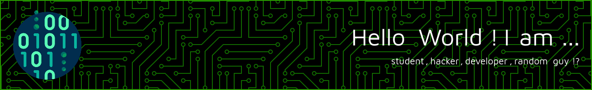

  
 
# About me

Hi, I’m @clemensGooooo aka cle.hack/Clemens.Gooooo.

I'm 16 years old, so still in something like German :school: high school.

Interested in computer science especially hacking, I did a lot of development stuff in different sections.

#### What I already had done:
- Hacking/Cybersecurity :lock:, learned a lot in the learning paths I did on TryHackMe/HackTheBox. (THM, HTB, etc.)
- CTF challenges, I love doing new CTF challenges and learning things on the way, platforms (THM, HTB, picoCTF)
- Participated at some German CTF challenges (CSCG,DBH)
- Sometimes I reasearch some stuff, lol :v: (Investigate interesting vulns and more...)
- Worked with linux servers :computer: and Dockers :whale:, Containers, VMs -> Virtualisation
- Front-End, Back-End development with different languages... (Backend: FastAPI,Express.JS Frontend: React, Plain JS/HTML/CSS)
- AI with Python :snake: (tensorflow and some other stuff)
- Website and Applications in JavaScript and Python with CSS,HTML :page_with_curl: and Markdown
- Worked with Arduino :skull: and ESP-Family and coded in C++, made some projects
- Worked on my self designed app :clock9: (React Native, and Web App)
- Build different complex Electron apps with vite/react-ts, did some React (Made a task manager, which has more functions)
- Mobile development, worked with React-Native
- Made some games in Unity (2D mostly, easier)
- Docker, deployed some applications (Dockerfiles, CMD)
- Made some stuff with databases  :file_folder: (mostly NoSQL like MongoDB, but sometimes SQL like: PostgreSQL,MySQL and some InfluxDB for ESP) 
- I have been using Linux, since I was a kid
- Websites were my intro into the stuff, I developed them all my free time

I think you get it ;)

Since 6 years I am programming, don't know why but I had a feeling to you tell that :sunglasses: !

Languages/Frameworkes/Libaries I interacted with:

## Platform profiles

- [TryHackMe](https://tryhackme.com/p/cle.hack)
- [PicoCTF](https://play.picoctf.org/users/Clemens_Gooooo)

## Mindset - Why don't ask?!

- I love learning new stuff
- I like to automate stuff
- I'm a hardware and software enthusiast
- I like to think like a engineer

 
